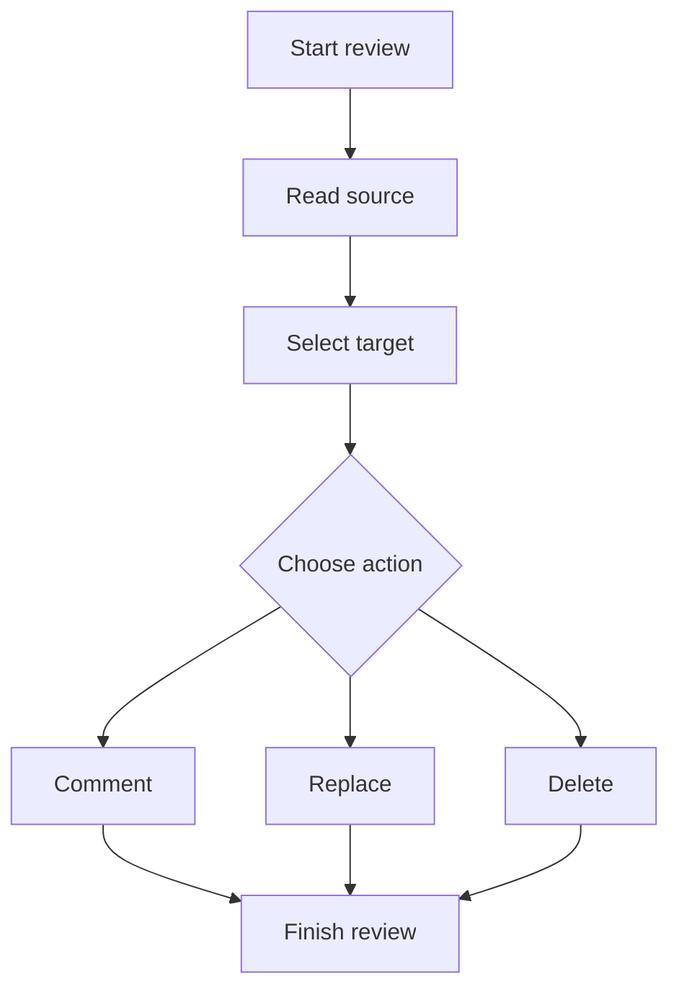

# Richie manual test plan

This document is both a manual test plan and a rich Markdown fixture for Richie.
Review it in Richie as a normal Markdown draft. Do not edit this file during the
review. Record every result in your test notes and take screenshots where a case
requests one.

The source file is the baseline for the later comparison. After finishing the
review, compare this original file with the generated `-commented.md` file.
Every expected marker should identify the intended operation, quote, replacement,
or scope. The original Markdown must remain otherwise unchanged. Do not treat the
commented file as a new canonical draft.

## Test setup and evidence rules

Use a copy of this file named `manual-test-run-v00.md` if you need to repeat the
run. The clean baseline must remain available as `manual-test-plan-v00.md`.

Before the first case:

1. Run `npm run check`, `npm test`, and `npm run build`.
2. Start the service with `npm start`.
3. Open this file with `npm run review -- manual-test-plan-v00.md`.
4. Confirm the page uses the light Rosé Pine Dawn presentation. There should be
   no dark-mode control.
5. Confirm the top toolbar contains `Document level note`, `Abort review`, and
   `Finish review`.
6. Confirm the left sidebar contains the user-guide link, search controls, and a
   document outline. Confirm the right sidebar says `0 open` and shows the empty
   feedback message.
7. Keep the browser developer console open. Record any error, warning, failed
   request, or unexpected page reload.

For each case, capture these evidence items unless the case says otherwise:

- the visible rendered state before the action;
- the action menu or dialog, if one is part of the case;
- the right-sidebar feedback card after saving; and
- the final rendered state after the operation is removed or changed.

Use the exact test text named in each case. This makes source quotes and later
commented-output comparison deterministic. If a selection is hard to make with a
mouse, use browser zoom at 100%, select from left to right, and repeat once from
right to left where the case requests a reverse selection.

## Case index

| ID | Area | Main behavior |
| --- | --- | --- |
| MT-01 | Baseline rendering | Markdown elements and light layout |
| MT-02 | Navigation | Outline links and scroll position |
| MT-03 | Search | Match count, current match, buttons, keyboard navigation |
| MT-04 | Hover menu | Delay, hover target, handoff, collision placement |
| MT-05 | Range comment | Word, phrase, line, and cross-line selections |
| MT-06 | Range replace | Inline, formatted, link, and code-span replacement |
| MT-07 | Range delete | Word, sentence, paragraph, and whole block deletion |
| MT-08 | Keyboard actions | `c`, `r`, `d`, `Escape`, modifier behavior |
| MT-09 | Tables | Cell comment, cell replace, clear cell |
| MT-10 | Tables | Row and column deletion |
| MT-11 | Lists and blocks | List item, checklist, quote, heading, and section controls |
| MT-12 | Fenced code | Source-line review and marker placement |
| MT-13 | Mermaid | SVG, source disclosure, source-line review, invalid diagram |
| MT-14 | Feedback inventory | Jump, edit, remove, open-count behavior |
| MT-15 | Dialog validation | Cancel, empty values, keyboard confirmation |
| MT-16 | Review lifecycle | Finish with open feedback and output path |
| MT-17 | Review lifecycle | Finish with no open feedback |
| MT-18 | Review lifecycle | Abort and sidecar cleanup |
| MT-19 | Source safety | Stale-source banner and blocked writes |
| MT-20 | Provenance comparison | Original versus commented Markdown |

## MT-01. Baseline rendering

### Steps

1. Scroll from the top to the bottom without hovering over a review target.
2. Confirm the title is an `h1` with a bottom rule.
3. Confirm the `h2` and `h3` hierarchy is visually distinct.
4. Confirm ordinary prose, *emphasis*, **strong text**, ~~strikethrough~~,
   `inline code`, a link, a blockquote, lists, a table, fenced code, a thematic
   break, and both Mermaid diagrams render as content rather than raw Markdown.
5. Hover the link `the company noticeboard`. Confirm it changes color without
   opening a new page unless clicked.
6. Hover the first table row and the code block. Confirm the page does not add
   inline buttons into the text flow merely because a target is hovered.

### Expected rendering

The page remains light and readable. Tables have a dark teal header row, alternating
body rows, rounded borders, and a hover tint. Code has a separate card with a purple
left border and horizontal scrolling if required. The Mermaid route map appears as
an SVG card, not as raw Mermaid syntax. The invalid Mermaid case near the end shows
an inline warning but does not remove its source disclosure.

## MT-02. Document outline and navigation

### Steps

1. In the left sidebar, click `Executive summary`.
2. Confirm the page scrolls that heading near the top of the reading area, below
   the sticky toolbar.
3. Click `Service catalogue`, `Dispatch rules`, and `Mermaid route map` in turn.
4. Confirm each target heading is the one that moves into view.
5. Resize the browser to a narrow desktop or tablet width and repeat the test.
6. Confirm the navigation moves into the page flow and the document remains
   readable.

### Expected rendering

The outline contains the rendered `h1`, `h2`, and `h3` labels only. Clicking a link
does not create feedback, change the source, or open a new tab. The target heading is
not hidden behind the sticky toolbar. At narrow width, the sidebars become normal
stacked sections.

## MT-03. Search and match navigation

### Steps

1. Click the search field and type `Orange Halt`.
2. Confirm the match count is greater than one and the first match is the current
   match.
3. Click `Next match` three times. Confirm the count advances and wraps at the end.
4. Click `Previous match` once. Confirm the count moves backward.
5. Press `Enter` in the search field and confirm it moves to the next match.
6. Press `Shift+Enter` and confirm it moves to the previous match.
7. Replace the query with `does-not-exist`. Confirm the count says `0 matches` and
   no stale match remains highlighted.
8. Press `Escape`. Confirm the field clears, highlights disappear, and focus leaves
   the field.
9. Search for `decision`. Confirm matches can cross ordinary paragraphs and code
   or diagram source text where that text is present in the rendered document.

### Expected rendering

The current match has a visibly stronger treatment than the other matches. The
count uses `current/total` format, such as `1/4`. Search navigation scrolls the
current match into view without creating an operation or changing the feedback
count.

## MT-04. Hover menu timing and placement

### Steps

1. Move the pointer over the sentence beginning `The Moonlight Railway Company
   runs`. Pause for less than 220 milliseconds, then move away. Confirm no menu
   appears.
2. Hover the same paragraph and pause for at least 220 milliseconds. Confirm one
   floating menu appears beneath the hovered paragraph with `Comment`, `Replace`,
   and `Delete`.
3. Move from the paragraph to the floating menu. Confirm the menu remains open.
4. Move away from both. Confirm it hides after a short delay.
5. Hover a heading, a blockquote, a list, and a code block. Confirm the hovered
   target gets a dashed outline and the menu follows that target.
6. Hover a target near the bottom of the viewport. Confirm the menu moves above
   the target when there is not enough room below it.
7. Scroll while a menu is visible. Confirm it repositions with the target while
   the target remains visible, and hides when the target leaves the viewport.
8. Press `Escape` while the menu is visible. Confirm it closes without feedback.

### Expected rendering

There is a single shared menu. It does not duplicate controls inside prose, table
cells, or code. The active target has a dashed outline. Menu placement stays within
the viewport and does not cover the selected text more than necessary.

## MT-05. Range comments at different spans

Each subcase creates one comment. Wait for the operation card and `N open` count to
update after every save.

### MT-05A. One word

Select exactly `dependable` in the sentence `It is trying to become the most
dependable.` Choose `Comment`. Enter:

> Confirm this claim with a service reliability measure.

Expected: the dialog says it is commenting on `dependable`; the saved card is
`comment · range`, quotes only `dependable`, and the selected word receives the
comment presentation. The containing paragraph is not highlighted as a whole.

### MT-05B. Phrase across inline formatting

Select exactly `well-timed decisions` in the opening paragraph, including the text
inside strong formatting but not the surrounding commas. Choose `Comment`. Enter:

> Explain how decisions become a measurable operating input.

Expected: the selection crosses the strong span correctly and the card quote is
the selected phrase, not the Markdown asterisks.

### MT-05C. One complete line

Select exactly the visible sentence `The route has a useful operating rhythm:`.
Choose `Comment`. Enter:

> This is a useful transition. Consider making the rule explicit earlier.

Expected: only that sentence is marked. The selection action menu is anchored to the
selection rather than to an unrelated hovered paragraph.

### MT-05D. Several lines in one paragraph

Select from `If the buns are cold` through `safety cannot`, including the two
sentences but excluding the paragraph before and after. Choose `Comment`. Enter:

> This is the clearest statement of the operating principle. Preserve it.

Expected: the card preserves the exact multiline quote and the rendered highlight
covers the selected range only.

### MT-05E. Reverse selection

Select `The railway connects seven small stations` from right to left. Choose
`Comment`. Enter:

> Check whether seven is still the current route count.

Expected: the card quote is in source order, not reverse order. No invalid-range
error appears.

### MT-05F. Selection crossing blocks

Select from the final words of the first `The route has a useful operating rhythm:`
paragraph through the beginning of the numbered list. Choose `Comment`. Enter:

> This selection crosses a paragraph boundary. Decide whether the rule deserves its own block.

Expected: a single range operation is created with a multiline quote. The selection
does not silently collapse to one block.

## MT-06. Range replacements

Create these replacements in a fresh review after removing the MT-05 operations or
keep them open and confirm each card separately.

### MT-06A. Ordinary inline replacement

Select `only train service` in the first paragraph. Choose `Replace`. Enter:

> sole train service

Expected: the dialog shows the source phrase. The card says `Replace with sole train
service`. The rendered source remains unchanged except for review presentation.

### MT-06B. Replacement crossing emphasis

Select `well-timed decisions` including the visible strong text. Replace it with:

> disciplined decisions

Expected: the replacement is stored as plain replacement text. The card quote is
visible text, not HTML or Markdown markup.

### MT-06C. Link text replacement

Select only `the company noticeboard`, not the URL. Replace it with:

> public noticeboard

Expected: only the link label is the source quote. The URL remains identifiable in
the source and the rendered link remains a link until an agent applies the change.

### MT-06D. Inline code replacement

Select `night-operations.toml` inside inline code. Replace it with:

> midnight-operations.toml

Expected: the code span is selectable as visible text. The card records the exact
filename and replacement. No raw backticks appear in the quote.

### MT-06E. Multiline replacement

Select the two sentences beginning `The catalogue changes seasonally` and ending
`whether or not the timetable says so.` Replace them with:

> The catalogue changes during festival periods. Orange Halt is added only when the
> published timetable announces it.

Expected: the card preserves the multiline quote and replacement. No neighboring
paragraph is included.

## MT-07. Range deletion and block deletion

### MT-07A. Delete one word

Select `strangely` in `strangely scarce in practice`. Choose `Delete`.

Expected: the selected text receives deletion styling and the card says `Mark the
selected text for deletion`.

### MT-07B. Delete a sentence

Select exactly `That distinction matters because a train that arrives beautifully
but unpredictably is still a poor train.` Choose `Delete`.

Expected: the sentence is marked, but the paragraph remains visible and the preceding
sentence remains outside the target.

### MT-07C. Delete a complete paragraph through its block menu

Hover the paragraph beginning `The investigation found three contributing factors:`.
Choose `Delete` from the hover menu, not from a text selection.

Expected: the card scope is `block`, its summary is `Delete this block`, and the
whole paragraph or list block represented by the hovered target is marked.

### MT-07D. Delete a whole heading block

Hover the `Closing note` heading. Choose `Delete`.

Expected: the heading block is the target. Confirm in the card quote and target
outline that the operation is attached to the heading range, not to the entire
document.

### MT-07E. Delete a whole list block

Hover the unordered list under `Questions for the next timetable`. Choose `Delete`.

Expected: the list block is targeted as one block. The card is not a range operation
for whichever list item happened to be under the pointer.

## MT-08. Keyboard shortcuts and selection priority

Use a clean review or remove each operation after observing it.

### Steps

1. Select the word `cinnamon` and press `c`. Enter `Comment using the keyboard.`
2. Select `emergency marmalade` and press `r`. Enter `emergency provisions`.
3. Select `the brass decision bell` and press `d`.
4. Confirm the three operations use the selected ranges and do not require the
   floating menu to be open first.
5. Focus the search field, select a search term, and press `c`, `r`, or `d`.
   Confirm no review operation is created from an input control.
6. Hold `Ctrl` or `Cmd` while pressing `c`, `r`, or `d` on selected text. Confirm
   the browser or operating-system shortcut is not intercepted by Richie.
7. Open a comment dialog and press `Escape`. Confirm it cancels the dialog without
   saving feedback.

### Expected rendering

Shortcuts work only for a non-collapsed document selection and do not fire inside
inputs, textareas, selects, or contenteditable controls. Modifier-key shortcuts are
ignored. Dialog Escape cancels the dialog; it does not create or remove feedback.

## MT-09. Table cell actions

Use the `Service catalogue` table. The table header is `Service`, `Departure
window`, `Best for`, and `Known hazard`.

### MT-09A. Cell comment

Hover the `Quiet journeys and reflective thinking` cell in the Moonbeam Local row.
Choose `Comment`. Enter:

> Add a concrete passenger segment for this service.

Expected: the menu offers cell actions, the card scope is `cell`, and the quote is
the cell's visible text. The whole row and the rest of the table do not receive the
review target styling.

### MT-09B. Cell replacement

Hover `Conductors speak in rhymes` in the Comet Limited row. Choose `Replace` and
enter:

> Conductors use an emergency call-and-response

Expected: the card scope is `cell`, with the cell quote and replacement. The
rendered table remains structurally intact.

### MT-09C. Clear cell

Hover `Apples may offer unsolicited advice` in the Orchard Sleeper row. Choose
`Clear cell`. Confirm if Richie presents a confirmation dialog.

Expected: the operation kind is `delete`, scope is `cell`, and the card says `Clear
this cell`. The table cell remains in place and is not confused with row deletion.

### MT-09D. Empty-cell validation

Hover any populated cell and choose `Replace`. Leave the replacement empty or type
only spaces. Confirm the dialog. Then cancel the informational `Replacement is
empty` dialog.

Expected: no operation is saved, the open count does not increase, and the original
cell remains unchanged.

## MT-10. Table row and column deletion

### MT-10A. Delete a row

Hover any cell in the `Dawn Shunter` row. Choose `Delete row`.

Expected: one open operation appears with scope `row`, summary `Delete this row`,
and target styling covers the row range. The operation is not reported as a cell
clear or a range deletion.

### MT-10B. Delete a column

Hover the `Known hazard` header or a body cell in that column. Choose `Delete
column`.

Expected: one operation appears with scope `column`. Every cell in the selected
column, including the header and all body rows, receives column-target styling. Cells
in the other columns do not.

### MT-10C. Column target stability

With the column operation open, hover a different column and create a comment on a
single cell. Confirm the column styling remains on the original column and the new
cell gets its own target styling.

Expected: overlapping review presentations remain distinguishable. The right panel
shows both open operations and their separate scopes.

### MT-10D. Table visual checks

Hover each table row after creating the column operation. Confirm row hover tint does
not erase the column target indication. Scroll the table horizontally if needed and
confirm the target remains attached to the same column.

## MT-11. Lists, checklist items, quotes, headings, and sections

### Steps

1. Hover the checked item `Confirm the ordinary passenger route`. Choose `Comment`
   and enter `This completed item should remain visible in the review.`
2. Hover the unchecked nested item `Ask the night signalmen`. Choose `Comment` and
   enter `Name the owner of this action.`
3. Hover the blockquote beginning `A timetable is a promise`. Choose `Replace` and
   enter `A timetable is an operating promise.`
4. Hover the `Dispatch rules` heading and choose `Comment`. Enter:
   `Clarify whether this is policy or an implementation example.`
5. Open the `Mermaid route map` source disclosure and hover the disclosure block.
   Choose `Comment` and enter `Keep the visual map, but explain the emergency path.`

### Expected rendering

Checklist boxes remain visible and disabled. Hover controls do not appear as
additional list items. Blockquote styling remains intact. The heading comment is
associated with the heading block. The Mermaid disclosure receives only its allowed
block-level Comment action.

## MT-12. Ordinary fenced code review

The `night-operations.toml` example is labelled `bash` even though it intentionally
contains pseudo-configuration syntax. Use the visible source lines inside the code
card.

### MT-12A. Source-line comment

Select exactly `hold_departure()` and choose `Comment`. Enter:

> State what condition is recorded when departure is held.

Expected: the selection targets the source text inside the code block, the card has
scope `range`, and the code remains readable. The action is not attached to the
surrounding paragraph.

### MT-12B. Source-line replacement

Select exactly `send_empty_train()` and choose `Replace`. Enter:

> dispatch_empty_train()

Expected: the code selection can be replaced as visible source text. The quote has
no syntax-highlighting markup.

### MT-12C. Source-line deletion

Select exactly `ring_decision_bell()` and choose `Delete`.

Expected: the deletion card retains the source quote and the rendered code line is
marked without moving the marker into the middle of the fenced block.

### MT-12D. Whole code block

Hover the code card outside a source-line selection and choose `Comment`. Enter:

> Confirm this pseudo-code is illustrative rather than executable.

Expected: the block-level comment card has the code block range. In the eventual
commented Markdown, the marker is after the closing fence, so the fenced source
continues to parse as code.

## MT-13. Mermaid rendering and source review

### MT-13A. Valid Mermaid visual rendering

Scroll to `Mermaid route map`. Confirm the diagram renders as an SVG with nodes for
Lantern Quay, Cedar Pass, Clockwork Orchard, Pigeon Observatory, and Orange Halt.
Confirm the emergency diversion is visually distinguishable from ordinary arrows.

Expected: no raw Mermaid text appears in the SVG area. SVG nodes, labels, and edges
are visual context only and do not expose independent review menus.

### MT-13B. Mermaid source disclosure

Click `Mermaid source`. Confirm the original source lines appear below the SVG.
Hover a source line. Confirm the line exposes `Comment`, `Replace`, and `Delete`.
Hover the `Mermaid source` disclosure itself. Confirm it exposes only `Comment`.

### MT-13C. Mermaid source-line operations

Select exactly `B --> C` in the source view. Create a comment:

> Confirm whether Cedar Pass is a station or a segment.

Select exactly `Orange Halt` in the `E[Orange Halt]` line. Create a replacement:

> Orange Halt station

Select exactly `classDef station` and delete it.

Expected: each operation quotes source text, not SVG text. The visual SVG is not
edited by the review. The eventual commented markers are placed after the closing
Mermaid fence, preserving valid source structure.

### MT-13D. Invalid Mermaid behavior

Open the `Invalid Mermaid example` section near the end. Confirm the invalid diagram
shows a readable inline `Mermaid did not render` warning. Expand its source and
select `this is not valid Mermaid`. Add the comment:

> Keep the invalid fixture. It verifies the source remains reviewable after render failure.

Expected: the warning does not remove the source view or prevent a source-range
operation.

## MT-14. Feedback inventory, jump, edit, and remove

First create at least one comment, one replacement, one deletion, one cell action,
and one document note.

### Steps

1. Confirm the right panel shows only open operations and the count matches the
   number of open cards.
2. On a range card, click `Jump to text`. Confirm the target scrolls into view and
   is visually identifiable.
3. On a comment card, click `Edit`. Replace the comment with:
   `Edited after the first reading.` Click `Save`.
4. On a replacement card, click `Edit`. Replace the proposed text with:
   `Updated replacement wording.` Click `Save`.
5. Attempt to edit a deletion card. Confirm it has no `Edit` button.
6. Click `Remove` on the edited comment. Confirm the card disappears, the open
   count decreases, and its target presentation is cleared.
7. Remove the column operation. Confirm all column-target styling disappears.

### Expected rendering

Editing updates the card and keeps the same operation identity. Removing feedback
supersedes it in the sidecar rather than exporting it as open feedback. The empty
panel message returns when all operations are removed.

## MT-15. Dialog validation, cancellation, and keyboard confirmation

### Steps

1. Open `Document level note`. Cancel the dialog. Confirm no operation is created.
2. Open it again and submit an empty value. Confirm the `Comment is empty` dialog
   appears. Dismiss it with `OK`; confirm the input dialog has not silently saved.
3. Enter `The recommendation needs to appear before the route detail.` in the note
   dialog. Submit with `Ctrl+Enter` on Linux or `Cmd+Enter` on macOS.
4. Create a range comment and use the same keyboard confirmation. Confirm it saves.
5. Open a replacement dialog, enter only spaces, and submit. Confirm the
   `Replacement is empty` message instructs you to use Delete for removal.
6. Cancel the replacement dialog. Confirm no operation is created.

### Expected rendering

Dialogs have a visible title, correct field label, appropriate confirm label, and a
cancel button for input dialogs. Destructive Abort confirmation uses the alert
color. Empty input never changes the right-panel count.

## MT-16. Finish with open feedback

Use a fresh review and create exactly these three operations:

1. A document note: `Lead with the operating rule.`
2. A range comment on `dependable`: `Support this with evidence.`
3. A column deletion on `Known hazard`.

### Steps

1. Confirm the three operations are open and visible.
2. Click `Finish review`.
3. Cancel the confirmation. Confirm the session remains open and all three cards
   remain.
4. Click `Finish review` again and confirm.
5. Confirm the completion dialog reports an exported `manual-test-plan-vNN-commented.md`
   path, where `NN` is the next available suffix.
6. Confirm the review tab attempts to close and the `.review.json` sidecar is gone.
7. Open the exported commented file as plain Markdown and inspect the output.

### Expected output

The document-level marker appears at the top. Range feedback appears after its
selected source text. A column deletion marker appears inside every affected table
cell, including the header, without breaking table fences. The original source file
is unchanged. The exported file is a review artifact, not a replacement source.

## MT-17. Finish with no open feedback

Use a new review or remove every open operation from an existing review.

### Steps

1. Confirm the right panel says `0 open` and shows `No feedback yet`.
2. Click `Finish review` and confirm the action.
3. Confirm the completion dialog says no feedback was recorded and nothing was
   exported.
4. Confirm no new `-commented.md` file was created and the sidecar was removed.

### Expected result

Finishing an empty review closes the session without creating a commented copy.
There is no phantom export and no leftover open sidecar.

## MT-18. Abort and sidecar cleanup

### Steps

1. Start a new review and create a document note and a range comment.
2. Confirm a `.review.json` sidecar exists beside the source while the review is
   active.
3. Click `Abort review`.
4. Cancel the destructive confirmation. Confirm the session and feedback remain.
5. Click `Abort review` again and confirm the destructive action.
6. Confirm the tab attempts to close, the sidecar is deleted, and no commented file
   is created.

### Expected result

Abort discards the active review session and exports nothing. It does not change the
original Markdown. Do not use Abort for a review whose operations must be retained.

## MT-19. Stale-source protection

Use a fresh review with one saved comment.

### Steps

1. Start the review and create a comment on `dependable`.
2. Without finishing or aborting, edit the source file outside Richie. Add the word
   `verified` after `dependable`, then save the source.
3. Reload the review page.
4. Confirm the stale-source banner says the Markdown source changed after the review
   started and that highlights may be misaligned.
5. Select a new phrase and attempt to create a comment. Confirm Richie blocks it
   with the source-change error.
6. Click `Finish review`. Confirm it reports that the source changed and that the
   feedback was retained.
7. Confirm the `.review.json` sidecar still exists and contains the first comment.
8. Restore the exact original source from Git. Reload and either finish after a
   deliberate review, or abort.

### Expected result

Richie never silently applies feedback to a different source hash. The sidecar is
retained on a source conflict so the saved operation is not lost.

## MT-20. Original versus commented Markdown comparison

Run this after MT-16 has exported a commented file. Use a text diff, not the HTML
projection.

### Checks

1. Confirm the original `manual-test-plan-v00.md` has no `<<ASB:` markers.
2. Confirm the commented file contains one marker for the document note at the top.
3. Confirm every selected range marker follows the selected source text and contains
   the expected operation ID, source quote, and comment or replacement.
4. Confirm deletion markers distinguish selected text, cells, rows, columns, and
   blocks.
5. Confirm row and cell markers stay within Markdown table rows.
6. Confirm column markers occur in every cell of the affected column and do not alter
   table pipes or separator syntax.
7. Confirm ordinary fenced-code markers occur after the closing fence.
8. Confirm Mermaid source markers occur after the closing Mermaid fence, not inside
   the code.
9. Confirm no SVG markup, `data-md-range`, CSS class, browser-generated identifier,
   or HTML review control was written into the Markdown.
10. Confirm feedback removed in MT-14 is absent from the exported open-feedback
    output.
11. Confirm the source text outside expected marker insertions is identical. Any
    unexpected source rewrite is a failure.

### Expected comparison conclusion

The original file remains canonical. The commented file is a source-preserving
review projection containing only the open feedback markers generated by the final
review state. Operations that were cancelled, removed, or superseded must not appear
as open feedback.

## Fixture: inline, block, list, and table text

The following content exists to support repeatable selections in future runs. Do not
skip it because earlier cases already use similar Markdown. Each paragraph and each
table cell is intentionally distinct.

### Distinct inline targets

Select `alpha word`, `beta phrase`, or `gamma sentence` separately when a future
test needs a short target. This line contains *italic target*, **strong target**,
`code target`, and [linked target](https://example.com/review-target) in one place.

The first sentence has a short target. The second sentence has a longer target that
crosses a line boundary when the browser is narrow. The third sentence ends with a
target suitable for a reverse selection.

### Distinct blocks

This is block A. It has one sentence and a stable opening phrase.

This is block B. It has two sentences. The second sentence makes block selection
visibly different from a sentence selection.

> This is block C, a quote with a stable source boundary.

- Block D item one has an independent target.
- Block D item two has a second independent target.

1. Block E item one is numbered.
2. Block E item two is numbered.

### Cell-level fixture

| Cell label | Cell comment target | Cell replace target | Cell clear target |
| --- | --- | --- | --- |
| Row one | Comment this exact cell | Replace this exact cell | Clear this exact cell |
| Row two | Comment the second cell | Replace the second cell | Clear the second cell |
| Row three | Comment the third cell | Replace the third cell | Clear the third cell |

### Row-level fixture

| Row identifier | Status | Owner | Review instruction |
| --- | --- | --- | --- |
| row-alpha | Ready | Mina | Delete this entire alpha row |
| row-beta | Waiting | Ravi | Delete this entire beta row |
| row-gamma | Blocked | Noor | Delete this entire gamma row |

### Column-level fixture

| Column A | Column B | Column C | Column D |
| --- | --- | --- | --- |
| A1 | B1 | C1 | D1 |
| A2 | B2 | C2 | D2 |
| A3 | B3 | C3 | D3 |

## Fixture: code blocks

The following blocks separate language handling from the operational examples above.

```json
{
  "review_id": "manual-001",
  "status": "open",
  "message": "Select JSON values without selecting the punctuation."
}
```

```typescript
function explainReview(scope: string, action: string): string {
  return `${action} applies to ${scope}`;
}
```

```text
plain text line one
plain text line two
plain text line three
```

Hover each block, select one token, select a whole line, and select two lines. Use
the same Comment, Replace, and Delete checks from MT-12. Confirm syntax coloring
does not change source quotes or marker placement.

## Fixture: valid Mermaid diagram



Use this smaller diagram to repeat source-line selection without the route map. The
SVG labels are not targets. The source lines are targets.

## Fixture: invalid Mermaid diagram

```mermaid
this is not valid Mermaid
```

The source disclosure must remain available even when the SVG cannot render.

## Fixture: thematic break and final paragraph

---

The final paragraph is deliberately below a thematic break. Hover the paragraph and
the break separately. Confirm the break has no review menu, while the paragraph has
the ordinary block menu. This also verifies that unsupported rendered elements do
not receive accidental controls.

